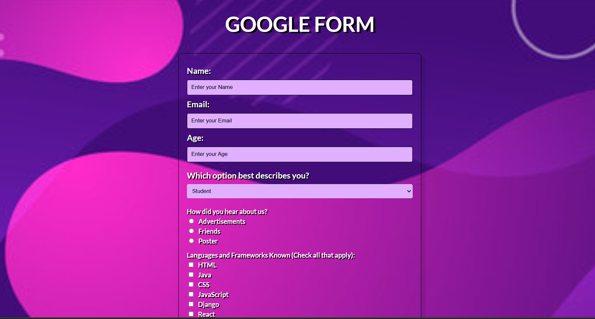
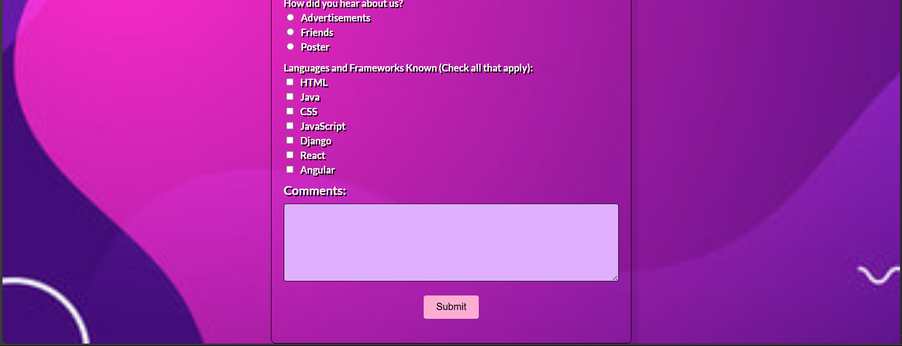

# Google Form

This repository contains a simple, responsive Google Form built with HTML and CSS. The form collects user information including name, email, age, status, source of referral, known programming languages and frameworks, and additional comments.

## Preview





## Table of Contents

- [Usage](#usage)
- [HTML Structure](#html-structure)
- [CSS Styling](#css-styling)
- [Customizations](#customizations)
- [Contributing](#contributing)
- [License](#license)

## Usage

1. **Clone the repository:**

```bash
git clone https://github.com/SHAHUL-AHMED-77/Google-Form.git
cd Google-Form
```

2. **Open the HTML file:**

   Open `index.html` in your preferred web browser to see the form in action.

## HTML Structure

The HTML file (`index.html`) includes a form that captures user details:

## Customizations

You can customize the form by modifying the HTML and CSS files. For example, you can:

- Change the background image by replacing `bg.jpg` with your desired image.
- Adjust the color scheme by modifying the CSS styles.
- Add or remove form fields by editing the HTML structure.

## Contributing

Contributions are welcome! Please fork the repository and create a pull request with your changes.

## License

This project is licensed